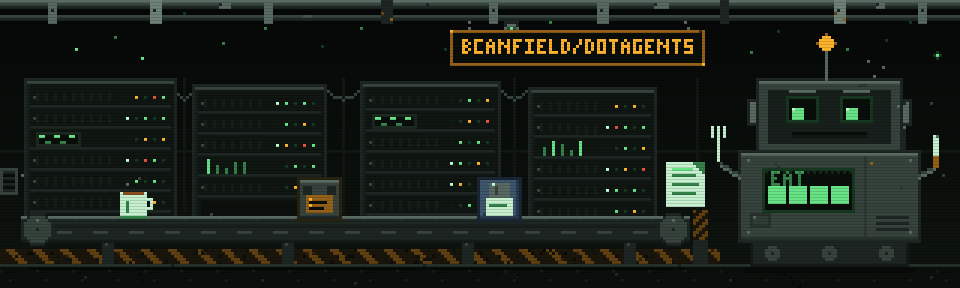

<p align="center">
  
</p>

# ~/.agents

The single source of truth for my global agent skills. Every skill's real files
live in [`skills/`](skills/) and are committed here. Agents read them from their
own directories via symlinks, so a `git pull` on a new machine is all it takes to
have every skill everywhere.

## How it fits together

```
~/.agents/skills/<name>/SKILL.md   the skill — real files, committed in this repo
~/.claude/skills/<name>            symlink -> ../../.agents/skills/<name>
.skill-lock.json                   CLI-managed manifest of installed skills — don't hand-edit
scripts/normalize-skills.sh        re-establish the symlink layout after any CLI run
```

- **Claude Code** reads `~/.claude/skills/`, so each skill needs a symlink there.
  [`scripts/normalize-skills.sh`](scripts/normalize-skills.sh) creates and repairs them.
- **Codex, Cursor, and other Agent-Skills-standard harnesses** read `~/.agents/skills/`
  directly — this folder *is* the standard global dir, so they need no symlink.

The [Vercel `skills` CLI](https://skills.sh) records what it installs in
`.skill-lock.json`. It only touches skills listed there, so **hand-written skills
stay safe from `skills update` / `skills remove` as long as they're kept out of the
lockfile** — which they are, because the CLI never adds them.

## The one gotcha: the CLI copies instead of symlinking inside an agent

When the CLI detects it's running **inside an agent** (e.g. you ask Claude Code to
run it), it installs non-interactively by **copying** skills straight into
`~/.claude/skills/` — bypassing the store and the symlinks. Run in a **plain
terminal** it prompts instead, and you pick *global + symlink* to get the right
layout directly.

Either way, the fix/prevention is the same one command, and it's idempotent:

```sh
bash ~/.agents/scripts/normalize-skills.sh
```

It moves any stray copies into `skills/`, (re)creates the `~/.claude/skills`
symlinks, and prunes dead ones. Run it after **anything** that touches skills, then
commit.

<details>
<summary>Installing a skill from the CLI</summary>

```sh
npx skills add mattpocock/skills            # interactive: pick skills, choose global + symlink
npx skills add mattpocock/skills -s tdd     # just one skill
npx skills add <owner/repo> -a claude-code  # target a specific agent
```

Avoid `-s '*'` on large repos — it pulls deprecated / in-progress / personal skills
too. After installing, normalize and commit:

```sh
bash ~/.agents/scripts/normalize-skills.sh
git add skills .skill-lock.json && git commit -m "add <skill>"
```

</details>

<details>
<summary>Writing my own</summary>

```sh
cd ~/.agents/skills
npx skills init my-skill
bash ~/.agents/scripts/normalize-skills.sh   # creates the ~/.claude symlink
```

The `name:` and `description:` frontmatter in `SKILL.md` is what makes it trigger.
New agent sessions pick it up automatically. Commit when happy.

Two things to avoid: don't name a skill the same as one the CLI installed (`skills
add` will offer to overwrite it), and don't add your own skills to the lockfile.

</details>

<details>
<summary>Maintenance</summary>

Golden rule: after any skill change, run `normalize-skills.sh`, then commit
`skills/` + `.skill-lock.json`.

- `npx skills update` — update CLI-managed skills, then normalize + commit
- `npx skills remove <name>` — drop a CLI skill and its symlink/copy, then normalize + commit
- `npx skills ls -g` — what the CLI thinks it owns
- remove one of mine: `rm -rf ~/.agents/skills/<name> ~/.claude/skills/<name>`

</details>

<details>
<summary>New machine</summary>

```sh
git clone <this repo> ~/.agents
bash ~/.agents/scripts/normalize-skills.sh
```

The script symlinks every skill in the store into `~/.claude/skills/`.

</details>
